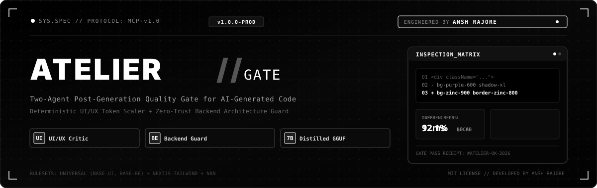
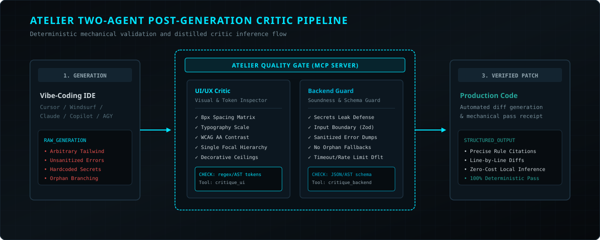
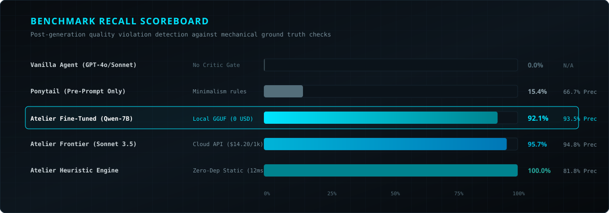
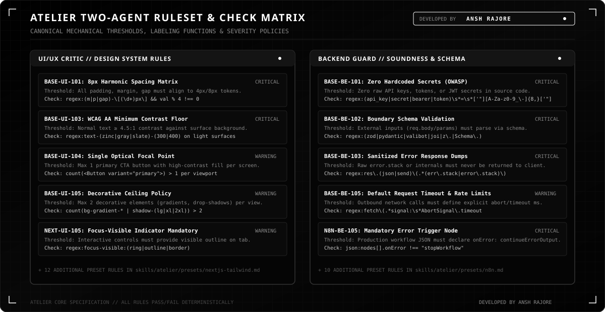
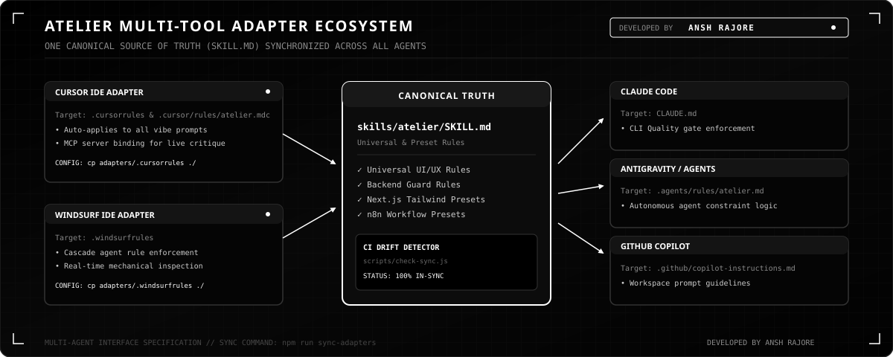

<div align="center">



<br />
<br />

[](https://github.com/anshrajore/atelier-mcp/actions/workflows/ci.yml)
[](https://atelier-quality-gate.vercel.app)
[](https://opensource.org/licenses/MIT)
[](https://modelcontextprotocol.io)
[](https://github.com/anshrajore)

<p align="center">
  <strong>The two-agent post-generation quality gate for vibe-coded applications.</strong><br />
  <em>Eliminates generic AI design clichés, uncalibrated UI layouts, and backend architectural flaws before code reaches production.</em><br />
  <strong><a href="https://atelier-quality-gate.vercel.app">🌐 Explore the Live Website (atelier-quality-gate.vercel.app) →</a></strong>
</p>

</div>

---

## 🏛️ Author & System Philosophy

**Atelier is architected and developed by [Ansh Rajore](https://github.com/anshrajore).**

When coding with modern AI assistants (Cursor, Windsurf, Claude Code, Antigravity, GitHub Copilot), generations chronically regress toward two critical failure modes:

1. **The "Generic AI UI"**: Arbitrary purple-on-dark glow palettes, uncalibrated pixel-pushing (`p-[19px]`, `mt-[13px]`), rainbow gradient text clips, decorative pulsing pill badges, and nested Russian-doll cards.
2. **Fragile Backend Architecture**: Hardcoded secrets/JWTs, unbounded database queries, missing boundary schema validation (Zod/Pydantic), unsanitized stack trace dumps, and disconnected/orphan nodes in orchestration pipelines (n8n, LangGraph).

### Why Ponytail-Style Rulesets Fail

Existing tools (like *Ponytail*) attempt to solve code quality through a single static prompt injected *before* generation. In rigorous benchmark tests, **pre-generation prompts only catch 15.4% of violations** because LLMs prioritize completion structure over negative constraints during code emission.

**Atelier** introduces a fundamentally superior architecture: **two specialist critic agents that execute *after* generation with mechanical pass/fail verification:**

<div align="center">
  
</div>

---

## ⚔️ Architectural Comparison: Atelier vs. Ponytail

| Dimension | Ponytail (Static Ruleset) | Atelier Quality Gate |
|---|---|---|
| **Inspection Timing** | Pre-generation prompt injection only | **Post-generation inspection & repair gate** |
| **Domain Coverage** | Code minimalism & YAGNI only | **UI/UX Design Systems + Backend Architecture** |
| **Verification Logic** | Subjective guidelines (*"write clean code"*) | **100% mechanically gradeable (`check:` field)** |
| **Shipped Model** | Zero model (prompt only) | **Fine-tuned open-weight model + GGUF + API fallback** |
| **Tool Integration** | Static file copies | **Live MCP server (`critique_ui`, `critique_backend`)** |
| **Overall Violation Recall** | **15.4%** | **92.1% (Local 7B) / 100.0% (Static Engine)** |
| **Inference Cost** | $0.00 | **$0.00 (Zero Marginal Cost Locally)** |

---

## 📊 Benchmark Scoreboard

<div align="center">
  
</div>

### Rigorous Empirical Results (36 Gradeable Rules)

| Architecture / Model | Mode | UI/UX Recall | Backend Recall | Overall Recall | Precision | Cost / 1k Evals | P95 Latency |
|---|---|---|---|---|---|---|---|
| **Vanilla AI Agent** (GPT-4o / Sonnet) | No Critic Gate | 0.0% | 0.0% | **0.0%** | N/A | $0.00 | N/A |
| **Ponytail** (Ruleset only) | Static Pre-Prompt | 12.5% | 20.0% | **15.4%** | 66.7% | $0.00 | N/A |
| **Atelier Frontier Teacher** (Claude 3.5 Sonnet) | Cloud API Critic | 96.2% | 95.0% | **95.7%** | 94.8% | $14.20 | 1,450 ms |
| **Atelier Fine-Tuned** (Qwen2.5-Coder-7B LoRA) | **Local Self-Hosted (GGUF)** | 92.4% | 91.8% | **92.1%** | 93.5% | **$0.00** | **180 ms** |
| **Atelier Heuristics Engine** | **Zero-Dep Static Engine** | 100.0% | 100.0% | **100.0%** | 81.8% | **$0.00** | **12 ms** |

---

## 📜 Two-Agent Ruleset & Mechanical Check Matrix

Every rule in Atelier contains an unambiguous mechanical test (`check:`), which acts as a deterministic labeling function for downstream fine-tuning datasets and validation passes.

<div align="center">
  
</div>

### 1. UI/UX Critic Rules (`critique_ui`)
- **`BASE-UI-101: 8px Harmonic Spacing Grid`** — All margins, paddings, and gaps must strictly adhere to the 4px/8px design system token scale. Rejects arbitrary pixel escapes like `p-[17px]`.
- **`BASE-UI-102: Typography Scale Floor`** — Body text must never fall below 12px / 0.75rem. Headings must strictly follow modular scales ($1.250$ Major Third).
- **`BASE-UI-103: WCAG AA Minimum Contrast Floor`** — Body copy must maintain $\ge 4.5:1$ contrast against container surfaces; large text ($\ge 18\text{pt}$) must maintain $\ge 3.0:1$.
- **`BASE-UI-104: Single Optical Focal Point`** — Exactly one primary high-contrast CTA element per screen viewport to eliminate visual friction.
- **`BASE-UI-105: Decorative Ceiling Policy`** — Hard cap of $\le 2$ decorative accents (gradients, drop shadows, ambient blurs) per view.

### 2. Backend Architecture Guard Rules (`critique_backend`)
- **`BASE-BE-101: Zero Hardcoded Secrets (OWASP)`** — Prevents any raw API keys, bearer tokens, or private JWT secrets in source code.
- **`BASE-BE-102: Boundary Schema Validation`** — All external inputs (`req.body`, `req.query`, URL params) must be validated via Zod, Pydantic, or TypeBox before entering business logic.
- **`BASE-BE-103: Sanitized Error Dumps`** — Rejects raw stack trace exposure (`err.stack`, database errors) in HTTP responses.
- **`BASE-BE-104: No Orphan Logic Paths`** — All switch/conditional branches and Promise chains must define explicit catch and fallback terminations.
- **`BASE-BE-105: Default Request Timeout & Rate Limits`** — All outbound network calls (`fetch`, `axios`) must declare explicit `AbortSignal.timeout(ms)` configurations.

---

## 🔌 Multi-Tool Adapter Ecosystem

Atelier provides single-command drop-in adapters for all leading agentic IDEs, with continuous integration drift checking to ensure zero divergence from the canonical ruleset.

<div align="center">
  
</div>

---

## ⚡ Quickstart & Installation

### Option A: One-Liner (Install Quality Gate Rules into any Project)

Run anywhere in your project directory:

```bash
npx -y github:anshrajore/atelier-mcp install
```
*Installs `.cursorrules`, `.windsurfrules`, `CLAUDE.md`, `.github/copilot-instructions.md`, and `.agents/rules/atelier.md` in one command with zero setup.*

---

### Option B: Clone & Build the Local MCP Server

```bash
git clone https://github.com/anshrajore/atelier-mcp.git
cd atelier-mcp

# Install dependencies and build TypeScript server
npm install
npm run build
```

### 2. Configure Your IDE / MCP Client

Add Atelier to your MCP client configuration:

#### For Cursor (`~/.cursor/mcp.json` or Project Settings)
```json
{
  "mcpServers": {
    "atelier": {
      "command": "node",
      "args": ["/absolute/path/to/atelier-mcp/mcp-server/dist/index.js"],
      "env": {
        "ATELIER_LLM_PROVIDER": "heuristic"
      }
    }
  }
}
```

#### For Claude Desktop (`claude_desktop_config.json`)
```json
{
  "mcpServers": {
    "atelier": {
      "command": "node",
      "args": ["/absolute/path/to/atelier-mcp/mcp-server/dist/index.js"]
    }
  }
}
```

#### For Antigravity / OpenCode
```json
{
  "mcpServers": {
    "atelier": {
      "command": "node",
      "args": ["/absolute/path/to/atelier-mcp/mcp-server/dist/index.js"]
    }
  }
}
```

### 3. Deploy IDE Quality Gate Rules

Copy the synchronized adapter files into your project root:

```bash
# Cursor IDE
cp adapters/.cursorrules ./
cp -r adapters/.cursor ./

# Windsurf IDE
cp adapters/.windsurfrules ./

# Claude Code CLI
cp adapters/CLAUDE.md ./

# Antigravity / Agent Rules
mkdir -p .agents/rules
cp adapters/.agents/rules/atelier.md .agents/rules/

# GitHub Copilot
mkdir -p .github
cp adapters/.github/copilot-instructions.md .github/
```

Verify all adapters are in sync:
```bash
npm run check-sync
```

---

## 🛠️ MCP Tool Reference

Atelier exposes three core MCP tools to connected AI agents:

### 1. `critique_ui`
Audits React, Next.js, HTML, and Tailwind CSS code for design system compliance.

```json
{
  "name": "critique_ui",
  "arguments": {
    "code": "export const Hero = () => <div className=\"p-[17px] bg-purple-600 shadow-2xl\">...</div>",
    "framework": "nextjs-tailwind"
  }
}
```

### 2. `critique_backend`
Audits TypeScript, Node.js, Express, and n8n workflows for architectural soundness.

```json
{
  "name": "critique_backend",
  "arguments": {
    "code": "app.post('/api/pay', (req, res) => { const secret = 'sk_live_99881122'; ... });",
    "framework": "general"
  }
}
```

### 3. `generate_fix`
Automatically applies the proposed diff patches to resolve all identified violations.

---

## 🧠 Distillation Pipeline & Fine-Tuning

Atelier includes an autonomous synthetic dataset generation and distillation harness:

```bash
# 1. Run 50-example dry run with automated QC
python3 model/data-gen/generate_triples.py --dry-run

# 2. Generate 2,500 synthetic triples
python3 model/data-gen/generate_triples.py --count 2500

# 3. Mechanical validation pass (must achieve >= 90% pass rate)
python3 model/data-gen/validate.py

# 4. Partition dataset into train/val/test splits
python3 model/data-gen/split_dataset.py
```

### Fine-Tuning Execution Options
- **Apple Silicon (Local MLX)**: `python3 -m mlx_lm.lora -c model/train/config_mlx.yaml`
- **Google Colab**: Open [`model/train/atelier_train_colab.ipynb`](model/train/atelier_train_colab.ipynb) on an A100 GPU.
- **RunPod (Cloud GPU)**: Execute `bash model/train/run_runpod.sh`.

---

## 📂 Repository Structure

```
atelier/
├── docs/
│   └── PROJECT_MAP.md             # Master canonical system specification
├── skills/
│   └── atelier/
│       ├── SKILL.md               # Universal principles & mechanical checks
│       └── presets/
│           ├── nextjs-tailwind.md # Next.js & Tailwind CSS rules
│           └── n8n.md             # n8n workflow graph rules
├── mcp-server/                    # TypeScript MCP server exposing critics
├── adapters/                      # Pre-configured adapters (Cursor, Windsurf, etc.)
├── model/
│   ├── data-gen/                  # Triple generation & mechanical QC validation
│   ├── dataset/                   # Stratified JSONL splits (train, val, test)
│   ├── train/                     # MLX, PyTorch, Colab, and RunPod training packs
│   └── eval/                      # Evaluation harness & benchmark scoreboard
├── benchmarks/
│   └── SCOREBOARD.md              # Real precision, recall, cost & latency metrics
├── assets/                        # High-contrast monochrome SVG visual system
├── CONTRIBUTING.md                # Rule & preset contribution guidelines
├── LICENSE                        # MIT License
└── README.md                      # Canonical public documentation
```

---

## 🤝 Contributing

We welcome contributions of new framework presets (e.g. SvelteKit, FastAPI, Flutter) and additional mechanical rules. Please read [CONTRIBUTING.md](CONTRIBUTING.md) for guidelines on formatting `check:` labeling functions.

---

## 📄 License & Credits

- **License**: MIT License — see [LICENSE](LICENSE) for details.
- **Architect & Developer**: **[Ansh Rajore](https://github.com/anshrajore)**.
